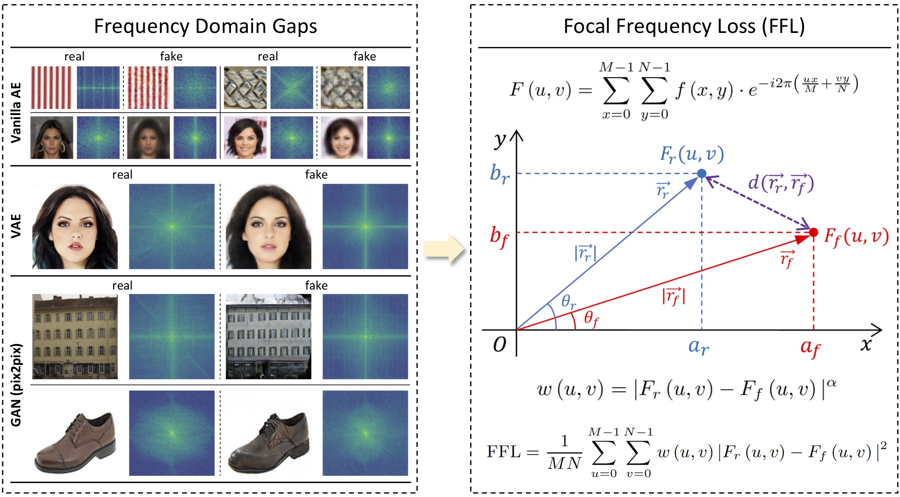

# Focal Frequency Loss for Generative Models



This repository will provide the official code for the following paper:

**Focal Frequency Loss for Generative Models**<br>
[Liming Jiang](https://liming-jiang.com/), [Bo Dai](http://daibo.info/), [Wayne Wu](https://wywu.github.io/) and [Chen Change Loy](http://personal.ie.cuhk.edu.hk/~ccloy/)<br>
arXiv preprint, 2020.<br>
[**Paper**](https://arxiv.org/abs/2012.12821)
> **Abstract:** *Despite the remarkable success of generative models in creating photorealistic images using deep neural networks, gaps could still exist between the real and generated images, especially in the frequency domain. In this study, we find that narrowing the frequency domain gap can ameliorate the image synthesis quality further. To this end, we propose the focal frequency loss, a novel objective function that brings optimization of generative models into the frequency domain. The proposed loss allows the model to dynamically focus on the frequency components that are hard to synthesize by down-weighting the easy frequencies. This objective function is complementary to existing spatial losses, offering great impedance against the loss of important frequency information due to the inherent crux of neural networks. We demonstrate the versatility and effectiveness of focal frequency loss to improve various baselines in both perceptual quality and quantitative performance.*

## Updates

- [12/2020] The [paper](https://arxiv.org/abs/2012.12821) of Focal Frequency Loss is released on arXiv.

## Code

The code will be made publicly available. Please stay tuned.

## Citation

If you find this work useful for your research, please cite our paper:

```
@article{jiang2020focal,
  title={Focal Frequency Loss for Generative Models},
  author={Jiang, Liming and Dai, Bo and Wu, Wayne and Loy, Chen Change},
  journal={arXiv preprint},
  volume={arXiv:2012.12821},
  year={2020}
}
```

## License

Copyright (c) 2020
