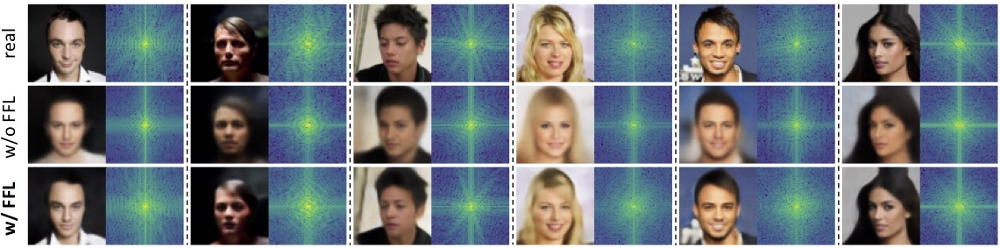
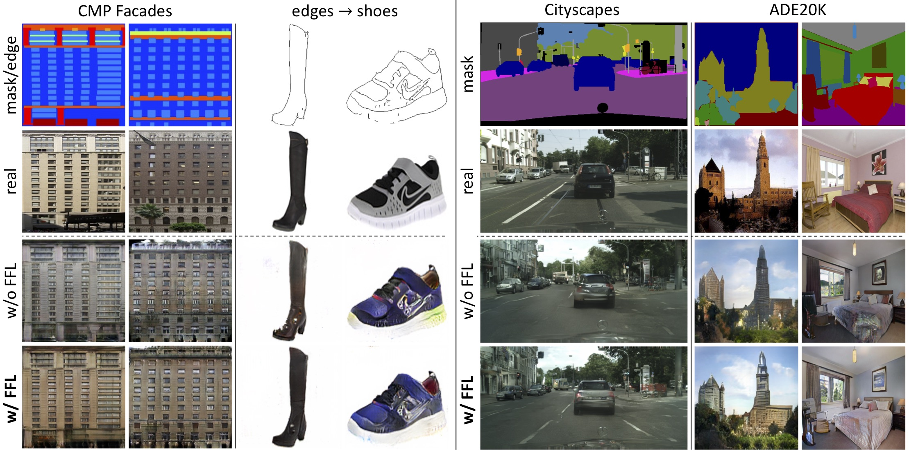
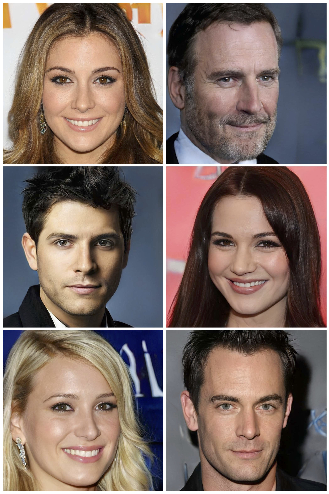

# Focal Frequency Loss


This repository will provide the official code for the following paper:

**Focal Frequency Loss for Image Reconstruction and Synthesis**<br>
[Liming Jiang](https://liming-jiang.com/), [Bo Dai](http://daibo.info/), [Wayne Wu](https://wywu.github.io/) and [Chen Change Loy](http://personal.ie.cuhk.edu.hk/~ccloy/)<br>
In ICCV 2021.<br>
[**Project Page**](https://www.mmlab-ntu.com/project/ffl/index.html) | [**Paper**](https://arxiv.org/abs/2012.12821)
> **Abstract:** *Image reconstruction and synthesis have witnessed remarkable progress thanks to the development of generative models. Nonetheless, gaps could still exist between the real and generated images, especially in the frequency domain. In this study, we show that narrowing gaps in the frequency domain can ameliorate image reconstruction and synthesis quality further. We propose a novel focal frequency loss, which allows a model to adaptively focus on frequency components that are hard to synthesize by down-weighting the easy ones. This objective function is complementary to existing spatial losses, offering great impedance against the loss of important frequency information due to the inherent bias of neural networks. We demonstrate the versatility and effectiveness of focal frequency loss to improve popular models, such as VAE, pix2pix, and SPADE, in both perceptual quality and quantitative performance. We further show its potential on StyleGAN2.*

## Updates

- [07/2021] The [paper](https://arxiv.org/abs/2012.12821) of Focal Frequency Loss is accepted by **ICCV 2021**.

## Code

The code will be made publicly available soon. Please stay tuned.

## Results

Here, we show some examples of applying the proposed focal frequency loss (FFL) under diverse settings.

### Image Reconstruction (VAE)



### Image-to-Image Translation (pix2pix | SPADE)



### Unconditional Image Synthesis (StyleGAN2)

256x256 results (without truncation) and the mini-batch average spectra (adjusted to better contrast):


1024x1024 results (without truncation) synthesized by StyleGAN2 with FFL:




## Citation

If you find this work useful for your research, please cite our paper:

```
@inproceedings{jiang2021focal,
  title={Focal Frequency Loss for Image Reconstruction and Synthesis},
  author={Jiang, Liming and Dai, Bo and Wu, Wayne and Loy, Chen Change},
  booktitle={ICCV},
  year={2021}
}
```

## License

Copyright (c) 2021
